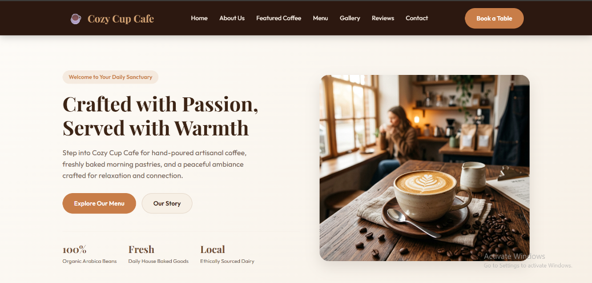
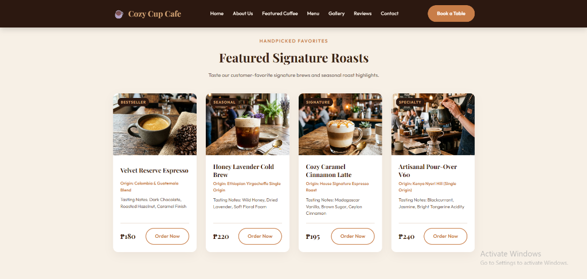
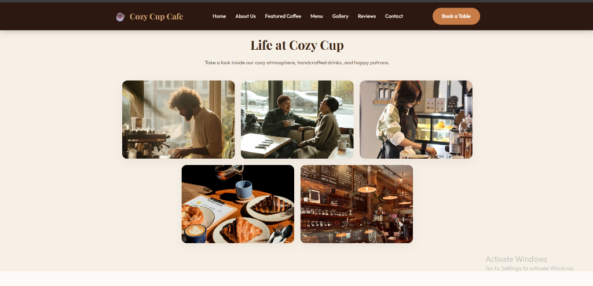
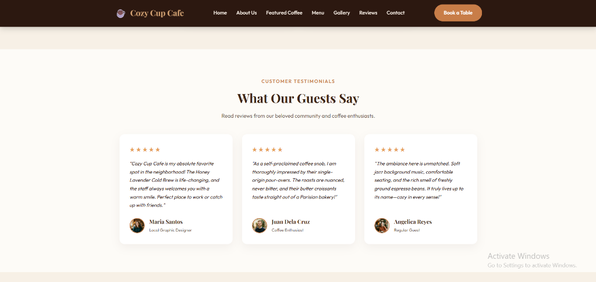

# ☕ Cozy Cup Cafe

## Project Description
Cozy Cup Cafe is a modern, artisanal, and responsive website designed for a warm and welcoming coffee shop located in **Puerto Princesa City, Palawan, Philippines**. Built using semantic HTML5 and vanilla CSS, the application features handcrafted typography (Playfair Display & Outfit), a rich espresso color palette, an interactive featured roasts gallery, Philippine Peso (₱) menu pricing, community testimonials, and an intuitive table reservation form.

## Features
- **Hero Sanctuary** — Welcoming entrance with quick navigation and ethical coffee highlights
- **Artisanal Craft** — 100% organic Arabica beans, ethical sourcing, and small-batch roasting
- **Signature Roasts** — Curated coffee cards displaying bean origins, tasting notes, and ₱ pricing
- **Full Menu** — Categorized selection of espressos, cold brews, teas, and fresh pastries
- **Atmosphere Gallery** — Photo grid highlighting daily cafe life, baristas, and fresh baked treats
- **Guest Reviews** — Testimonials showcasing 5-star community feedback from local regulars
- **Reservations & Hours** — Interactive booking form, opening hours, and Palawan contact details
- **Responsive Design** — Clean Flexbox and Grid layout built for mobile, tablet, and desktop

## Screen Captures

### 1. Hero Sanctuary & Brand Story

### 2. Featured Signature Roasts & Menu Pricing (₱)

### 3. Life at Cozy Cup (Atmosphere & Candid Gallery)

### 4. Customer Testimonials & Community Reviews

## About the Authors

**Name:** mijjinx  
**Email:** rdigermo@gmail.com  

**Name:** leeh-archives 
**Email:** lomocsoleehvann@gmail.com  

